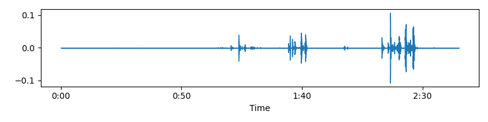
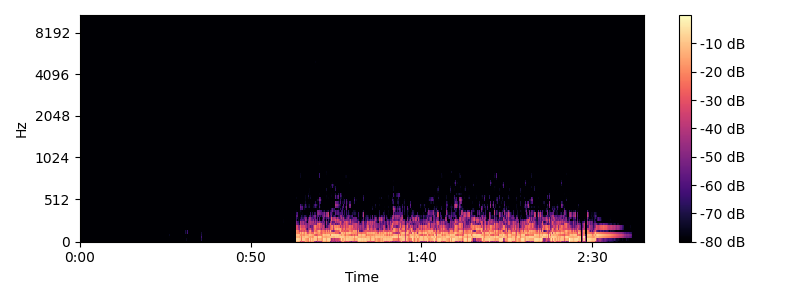

# 🎵 AI Vocal Separator

### **Term Project 01 – AI Model to User Application**

**Author: Seoyeong Kim (20240932)**

---

## 📌 1. Purpose

This project follows the full development cycle required by **Term Project 01 – AI Model to User Application**, including:

* AI idea development
* Pipeline design
* Model selection (pretrained model from open-source code)
* Environment setup
* Model analysis
* CLI → Web application development
* Visualization using signal processing tools
* Git-based code management
* Distribution & documentation
* Demo video for advertisement

The goal is to understand *how an AI model evolves into a real-world user application*.

---

## 🚀 2. Motivation & Background

### **Motivation**

I observed many people using Apple’s **Sing** (vocal-removal) feature, but:

* It does **not** work for every song
* It cannot separate individual instruments
* Creators and musicians want more flexible and accurate tools

This motivated me to build an **AI-powered vocal/instrument separator** that works for any MP3 file.

### **Model Selection – Spleeter**

I selected **Spleeter (by Deezer Research)** because:

* Open-source
* Pretrained U-Net architecture
* High-quality separation (2/4/5 stems)
* Supports both CLI and Python API
* Industry-level performance

---

## 🧩 3. Project Pipeline (Simplified)

```
User Upload → Flask Backend → Librosa Preprocessing
       ↓
Spleeter Model (2/4/5 stems)
       ↓
Separated Stems (WAV)
       ↓
Generate Waveform & Spectrogram Images
       ↓
Return Results to Browser
```

---

## 🧠 4. Model Analysis Summary

### **1) STFT (Short-Time Fourier Transform)**

Converts waveform (time domain) → spectrogram (frequency domain)

### **2) U-Net Architecture**

* Encoder: extracts features
* Bottleneck: learns instrument-specific patterns
* Decoder: reconstructs masks
* Skip connections: reduce loss of information

### **3) Soft Masking + Inverse STFT**

Applies predicted masks → reconstructs each stem → outputs WAV files.

---

## 🖥 5. System Requirements

### ✔ Python Version

* **Python 3.8 ~ 3.10 supported**
* Python 3.11+ **NOT supported** (Spleeter incompatible)

### ✔ FFmpeg required (audio I/O)

Ubuntu:

```bash
sudo apt-get install ffmpeg
```

Windows:

```bash
choco install ffmpeg
```

### ✔ Install dependencies

```bash
pip install -r requirements.txt
```

---

## 💻 6. Usage

### **CLI Version**

Run default (2 stems):

```bash
python main.py
```

Choose model:

```bash
python main.py -m 4stems
```

Choose MP3 file:

```bash
python main.py -i my_song.mp3
```

---

### **Web Version (Flask)**

Run server:

```bash
python app.py
```

Open browser:

```
http://localhost:8000
```

Upload MP3 → choose stem model → separate.

---

## 📂 7. Output Structure

```
output/
 ├── test_song/
 │   ├── vocals.wav
 │   ├── accompaniment.wav
 │   ├── drums.wav
 │   ├── bass.wav
 │   └── other.wav
```

---

## 📊 Example Visualization Outputs

Below are sample **waveform** and **spectrogram** images automatically generated by the app using `librosa` and saved in `static/` during processing.

### 🎼 Waveform Example
`static/waveforms/piano_wave.png`




### 🔥 Spectrogram Example
`static/spectrograms/bass_spec.png`




---

## 🎥 Demo Video

`demo.mp4`


---

## 📦 10. Code Structure

```
EF2039_AI_TERMPROJECT/
 ├── app.py
 ├── main.py
 ├── requirements.txt
 ├── templates/
 │   └── index.html
 ├── static/
 │   ├── waveforms/
 │   └── spectrograms/
 ├── output/
 ├── uploads/
 └── README.md
```

---


## 🔮 11. Future Extensions

* Fine-tuning for **engineering-frequency signal analysis**
* Instrument-wise **sheet music generation**
* Real-time vocal removal (streaming)
* AI-assisted music arrangement tools
* Acoustic fingerprinting research


